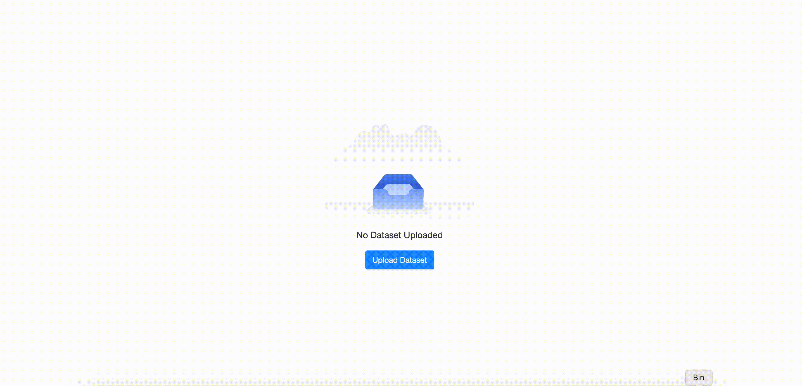

# shiny.emptystate

> _Empty state components for Shiny._

<!-- badges: start -->

[](https://app.codecov.io/gh/Appsilon/shiny.emptystate/)
<!-- badges: end -->


[Empty states](https://www.nngroup.com/articles/empty-state-interface-design/) are situations where there is no data to display to the user. A good example is an empty shopping cart on an e-commerce site.

In the context of dashboards you can encounter empty states when:

1. Before displaying any charts a user needs to upload a file containing the required data
2. Users apply different filters to a dataset and there is no row matching the configured filters



The goal of this package is to make it easy to handle empty states in your shiny applications.

## How to install?

```r
remotes::install_github("Appsilon/shiny.emptystate")
```

## How to use it?

To start using `shiny.emptystate`, you need to:

1. Include `use_empty_state()` in your UI definition
2. Define the content you want to display as an empty state (e.g. a message)
3. Create an instance of the `EmptyStateManager` class where you define by the `id` which element of your app should be covered with the empty state content
4. Use its `show` and `hide` methods to show or hide the empty state content depending on your custom logic (e.g. `nrow(data_to_display) > 0`)

```r
library(shiny)
library(shiny.emptystate)
library(reactable)

ui <- fluidPage(
  use_empty_state(),
  actionButton("show", "Show empty state!"),
  actionButton("hide", "Hide empty state!"),
  reactableOutput("my_table")
)

server <- function(input, output, session) {
  empty_state_content <- div(
    "This is  example empty state content"
  )

  empty_state_manager <- EmptyStateManager$new(
    id = "my_table",
    html_content = empty_state_content
  )

  observeEvent(input$show, {
    empty_state_manager$show()
  })

  observeEvent(input$hide, {
    empty_state_manager$hide()
  })

  output$my_table <- reactable::renderReactable({
    reactable(iris)
  })
}

shinyApp(ui, server)
```

For more examples of empty state components, please see this [demo](https://connect.appsilon.com/shiny-emptystate-demo/).

## How to contribute?

If you want to contribute to this project please submit a regular PR, once you're done with new feature or bug fix.

Reporting a bug is also helpful - please use [GitHub issues](https://github.com/Appsilon/shiny.emptystate/issues) and describe your problem as detailed as possible.

## Appsilon


Appsilon is a **Posit (formerly RStudio) Full Service Certified Partner**.<br/>
Learn more at [appsilon.com](https://appsilon.com).

Get in touch [opensource@appsilon.com](mailto:opensource@appsilon.com)

Explore the [Rhinoverse](https://rhinoverse.dev) - a family of R packages built around [Rhino](https://appsilon.github.io/rhino/)!

<a href = "https://appsilon.com/careers/" target="_blank"></a>
