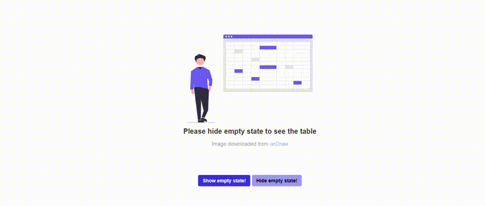

# Introduction

`shiny.emptystate` allows for easy creation and handling of empty state components in a Shiny application. 
Users can create empty state components by creating their own html contents. 
This means that users can also include images, including those from illustration services like [DrawKit](https://www.drawkit.com/illustration-types/all) and [unDraw](https://undraw.co/illustrations), in their empty states. 

# Including Images

Using images as empty state can be as easy as providing the `src` in `shiny::tags$image()`/`shiny::tags$img()`.

For vanilla Shiny, we suggest storing your images in a directory within `www`.
When creating the empty state manager, either use the path to the image, e.g. `www/img/image.png` as `src`

```r
empty_state_manager <- EmptyStateManager$new(
    id = "myElement",
    html_content = tags$image(src = "www/img/image.png")
  )
```
Or if you are using the utility function `empty_state_component()`, 

```r
empty_state <- empty_state_component(
  content = tags$img(src = "www/img/image.png"),
  title = "No content to display"
  )
```
For a [Rhino](https://appsilon.github.io/rhino/index.html) application, we suggest storing images in a directory within `app/static`. Rhino encourages the use of Shiny modules, so when creating an empty state manager always namespace the id of the element you want to handle.

If the image is in `app/static/img/image.png`, you can use the same code as above.
Update the `src` path accordingly.

```r
# In your module's server function
ns <- session$ns

empty_state_manager <- EmptyStateManager$new(
    id = ns("myElement"),
    html_content = tags$image(src = "app/static/img/image.png")
  )
  
empty_state <- empty_state_component(
  content = tags$img(src = "app/static/img/image.png"),
  title = "No content to display"
  )
```

All image file formats (including `gif`) should work, but we suggest using `png` and `svg`.
URL paths can also work, but we suggest keeping the images in the application's directory path.

The size of the images can be specified inline, e.g. `style = "height = "10rem"`, or through CSS.

# Using Images from DrawKit/unDraw

**Important:** Before using illustrations from the mentioned services, please get acquainted with their respective licenses: [DrawKit License](https://www.drawkit.com/license), [unDraw License](https://undraw.co/license).

We will use an image from unDraw as an example.

For vanilla Shiny, the path to the image can be `www/undraw_spreadsheet_re_cn18.svg`.

For Rhino, path to the image can be `app/static/img/undraw_spreadsheet_re_cn18.svg` but the path passed to `src` should only be `/static/img/undraw_spreadsheet_re_cn18.svg`.

The example below works for vanilla Shiny.

```r
library(shiny)
library(shiny.emptystate)
library(reactable)
library(fontawesome)

ui <-
  fluidPage(
    tags$head(
      tags$style(HTML(
        "body > div.container-fluid {
          display: flex;
          flex-direction: column;
          align-items: center;
        }

        #my_table {
          margin-top: 5rem;
          margin-bottom: 2rem;
        }

        #my_image {
          height: 25rem;
        }

        #toggle_emptystate_buttons {
          display: flex;
          flex-direction: row;
          align-items: center;
        }

        #show {
          border-color: transparent;
          border: 0;
          background-color: #3838fa;
          color: white;
          font-weight: 600;
          margin-right: 0.25rem;
        }

        #hide {
          border-color: transparent;
          border: 0;
          background-color: #9c9cfc;
          color: black;
          font-weight: 600;
          margin-left: 0.25rem;
        }"
      ))
    ),
    use_empty_state(),
    reactableOutput("my_table", width = "60%"),
    tags$div(
      id = "toggle_emptystate_buttons",
      actionButton("show", "Show empty state!"),
      actionButton("hide", "Hide empty state!")
    )
  )

server <- function(input, output, session) {
  empty_state_content <-
    empty_state_component(
      tags$image(id = "my_image", src = "undraw_spreadsheet_re_cn18.svg"),
      title = "Please hide empty state to see the table",
      subtitle = tags$span(
        "Image downloaded from ", 
        tags$a("unDraw", href = "https://undraw.co/illustrations")
      )
    )

  empty_state_manager <- EmptyStateManager$new(
    id = "my_table",
    html_content = empty_state_content
  )

  observeEvent(input$show, {
    empty_state_manager$show()
  })

  observeEvent(input$hide, {
    empty_state_manager$hide()
  })

  output$my_table <- reactable::renderReactable({
    reactable(iris)
  })
}

shinyApp(ui, server)
```



Note that the empty state component was built using `empty_state_component()`, but you can create a more customized empty state component that will allow you to use more than one image. Adding ids on images may also be useful when it comes to styling, e.g. setting the proper image size via CSS.
